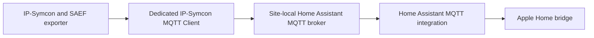

# 24 Site Broker and MQTT Client Transport Report

**Case study:** IP-Symcon MQTT Discovery Exporter
**Status:** Transport implementation and offline migration verification complete
**Date:** 2026-07-16
**Deployment status:** Repository candidate updated; prepared live client remains inactive

## 1. Decision

Each installation site uses its existing Home Assistant MQTT broker as the
broker boundary for SAEF discovery export. IP-Symcon connects outbound through
a dedicated MQTT Client. A new IP-Symcon MQTT Server is not required for this
path, and a Zigbee2MQTT broker connection is not reused merely because it is
already available.



This keeps site routing, credentials and failure domains explicit. Separate
sites receive separate client instances and topic namespaces. Device protocols
such as Zigbee2MQTT remain independent even when MQTT is their common wire
protocol.

## 2. Configuration Contract

The normalized MQTT configuration now uses a transport and a generic gateway
identity:

```php
'mqtt' => [
    'transport' => 'client',
    'gatewayID' => $siteMqttClientID,
    'baseTopic' => 'saef/site-a',
    'discoveryPrefix' => 'homeassistant',
],
```

Supported transports are `client` and `server`. The runtime verifies both the
gateway module and the corresponding MQTT Device module before it creates an
adapter. The legacy `serverID` input remains accepted for server configurations
and is normalized to `gatewayID`; new configurations should use the generic
contract.

## 3. Runtime and Ownership Changes

Command subscribers and outbound publishers are created with the MQTT Device
module matching the configured gateway. Registry entries record that module
identity for every managed entity and publisher.

Changing transport is an ownership migration, not an in-place reconnect. With
cleanup disabled, the runtime rejects the change. With explicit cleanup
enabled, it:

1. validates exact ownership of the old adapters;
2. clears retained topics where required;
3. removes the old events and device adapters;
4. creates adapters for the new transport;
5. republishes the desired discovery and runtime state.

This prevents a Registry entry from silently claiming an adapter of a different
module type.

## 4. Verification

The deterministic fake Symcon runtime now models both official gateway/device
pairs. Tests verify:

- legacy server configuration normalization;
- explicit client configuration normalization;
- gateway/module compatibility checks;
- command adapter preparation through an MQTT Client;
- retained publication through MQTT Client Device adapters;
- rejection of transport changes without cleanup;
- complete server-to-client migration with cleanup;
- preservation of all previous server-transport behavior.

All MQTT exporter test groups and the generated filesystem deployment check
pass after the change.

## 5. Live Activation Boundary

Preparing an inactive client and socket is safe infrastructure staging. Final
activation still requires a dedicated broker account entered directly in the
target system, followed by a bounded connection test and one supervised pilot
entity. Credentials, private addresses, site names and installation ObjectIDs
remain outside the public repository.

## 6. References

- [IP-Symcon MQTT Client](https://www.symcon.de/de/service/dokumentation/modulreferenz/geraete/mqtt/mqtt-client/)
- [IP-Symcon MQTT](https://www.symcon.de/de/service/dokumentation/modulreferenz/geraete/mqtt/)
- [SymconHomeAssistant](https://github.com/bumaas/SymconHomeAssistant)
